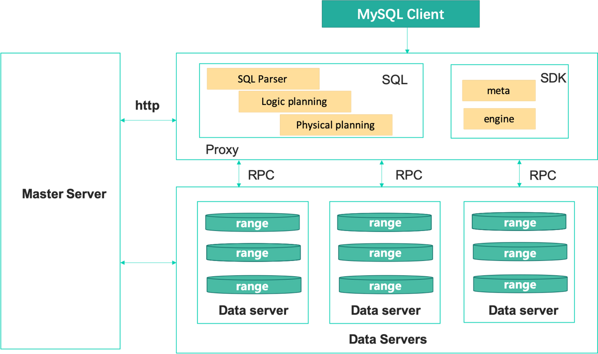

Introduction
=============

ChubaoDB is a cloud-native memory-centric distributed database, R & D based on google spanner paper, support Redis protocol and MySQL protocol; 

can be understood as JIMDB/redis +  Vitess/MySQL

Description
-----------------------

The design is guided by the following features: 

blazing fast, highly scalable and available, high memory utilization, durable, transactional

change histories, change feeds

High Level Architecture
-----------------------

Master Server

* Metadata management (routing, schema, etc.)

* Cluster dispatching (failover, balanced scheduling, etc.).

Proxy

* Handling user SQL client access

* Analyze SQL, logic optimization, physical optimization finally to data node read and write data

Data Server

* data storage node

* Slice by range, raft-3

Key Features
----------------

High Performance
^^^^^^^^^^^^^^^^^^^^^^^^

* Memory centric

* Excellent read performance + good write performance

Low Cost
^^^^^^^^^^^^^^^^^^^^^^^^

* Dual storage engines

* Intelligent scheduling

Availability, Consistency, Scalability, and Reliability
^^^^^^^^^^^^^^^^^^^^^^^^^^^^^^^^^^^^^^^^^^^^^^^^^^^^^^^^^^

* Raft-base replication

* Automatic range partitioning & balancing

* Automatic failover

Cloud Native
^^^^^^^^^^^^^^^^^^^^^^^^^^^^^^^

* Orchestrated by Kubernetes

Easy migration
^^^^^^^^^^^^^^^^^^^^^^^^^^^^^^^

* Migration tools

* Support Redis/MySQL, almost no need to change code

Managable
^^^^^^^^^^^^^^^^^^^^^^^^^^^^^^^^^^^^^^^^^^^^^^^^

* management system

* alarm system

* rich monitoring report

Architecture
^^^^^^^^^^^^^^^^^^^^^^^^^^^^^^^^^^^^^^^^^^^^^^^^

proxy, master, dataserver - rowserver & idxserver

zone (i.e. datacenter or pod): any range is replicated across 3 zones, and if all zones are powered off, some fresh writes might be not persistent.

index tables: distributed tries; tables of data rows: distributed arrays.

* ranges

* shards

the resource isolation model: all DB instances share the set of dataservers, and a proxy can be shared or exclusively used.

Memory Store
^^^^^^^^^^^^^^^^^^^^^^^^^^^^^^^^^^^^^^^^^^^^^^^^

masstree is chosed as our default RAM key-value engine

row store, not column-oriented store, i.e., -->

one basic design decision: 1) one masstree per range, or 2) one masstree per DS, or 3) multiple masstree instances - ranges of different tables have different trees and two splitted ranges can share one tree.

we have chosen 3 for better performance + faster split.

Persistence
^^^^^^^^^^^^^^^^^^^^^^^^^^^^^^^^^^^^^^^^^^^^^^^^

a range has a WAL, and each log record is idempotent.

a range is snapshotted at intervals - say WAL has grown 32MB.

a snapshot file = marshalled masstree key-value pairs + metadata (checksum, WAL offset, etc.)

logging is optimized to reduce lock contention

snapshot and WAL files are stored onto ChubaoFS, which is leveraged for Backup & Recovery.

Replication
^^^^^^^^^^^^^^^^^^^^^^^^^^^^^^^^^^^^^^^^^^^^^^^^

parallel multi-raft

lease

foreach range, its raft log is idempotent.

raft log files are on the local disk for performance

Sharding
^^^^^^^^^^^^^^^^^^^^^^^^^^^^^^^^^^^^^^^^^^^^^^^^

a range replica = sorted key-value pairs in MassTree + WAL + raft log

range split
^^^^^^^^^^^^^^^^^^^^^^^^^^^^^^^^^^^^^^^^^^^^^^^^

there are two options: 1) logical split; 2) physically split the masstree quickly

we choosed 1.

for a newly splitted range, DS triggers its first snapshot (not to marshall the entire range, but to make a 'soft link' - record the names of its parent's snapshot and WAL file as the content), and allocates its own WAL file.

TODO:

* 1) pre-active split

* 2) no split for auto-incr pk

range movement
^^^^^^^^^^^^^^^^^^^^^^^^^^^^^^^^^^^^^^^^^^^^^^^^

dynamic re-balancing by the master

implemented via adding and removing raft replica

Transactions
^^^^^^^^^^^^^^^^^^^^^^^^^^^^^^^^^^^^^^^^^^^^^^^^

2PL-based distributed trxn

Online Schema Change
^^^^^^^^^^^^^^^^^^^^^^^^^^^^^^^^^^^^^^^^^^^^^^^^
todo

Dataflow
^^^^^^^^^^^^^^^^^^^^^^^^^^^^^^^^^^^^^^^^^^^^^^^^

we divide SELECT queries into two kinds: basic indexed queries and complex relational query e.g. JOIN, GROUP BY...

precomputes and stores complex query results so that reads are blazing fast.

Change History
^^^^^^^^^^^^^^^^^^^^^^^^^^^^^^^^^^^^^^^^^^^^^^^^

the range WAL logs are immutable and permanently stored on ChubaoFS.

Change Feed
^^^^^^^^^^^^^^^^^^^^^^^^^^^^^^^^^^^^^^^^^^^^^^^^

re-use the WALs on ChubaoFS to capture data changes

Test Plan
^^^^^^^^^^^^^^^^^^^^^^^^^^^^^^^^^^^^^^^^^^^^^^^^

expected goals:

passed the Jepsen tests

performance & scalability: outperforms Vitess+JIMDB

